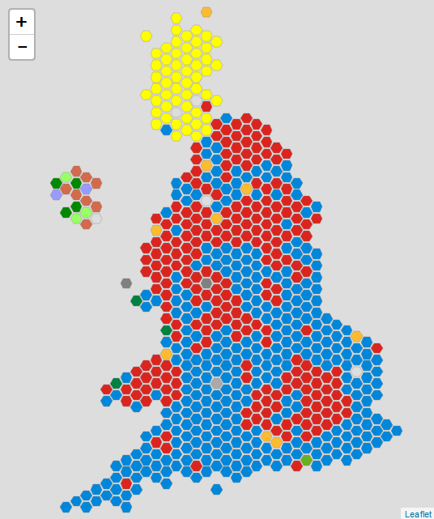

<!-- README.md is generated from README.Rmd. Please edit that file -->

```{r, echo = FALSE}
knitr::opts_chunk$set(
  collapse = TRUE,
  comment = "#>",
  fig.path = "README-"
)
```


[](https://github.com/EvanOdell/parlitools/blob/master/LICENSE)
[](https://github.com/evanodell/parlitools)
[](https://cran.r-project.org/package=parlitools)
<!--[](https://dgrtwo.shinyapps.io/cranview/)-->
[](https://travis-ci.org/EvanOdell/parlitools)
[](https://zenodo.org/badge/latestdoi/86801920)
[](https://codecov.io/github/EvanOdell/parlitools?branch=master)

# parlitools

A collection of useful tools for UK politics, including base maps and datasets. Initially inspired by Bhaskar Karambelkar's [`tilegrams`](https://cran.r-project.org/package=tilegramsR) package, but with the ability to create a hexagonal map of UK parliamentary constituencies. The package also includes functions for data retrieval of current MPs and their consituency details (as it requires calls to two different APIs, this function is not included in my [`hansard`](https://cran.r-project.org/package=hansard) or [`mnis`](https://cran.r-project.org/package=mnis) packages), and data from the 2015 UK General Election, courtesy of the British Election Study.

The most up-to-date documentation for the development version will always be at http://evanodell.com/parlitools/. 

## Installing

At present `parlitools` is only available on GitHub, although a CRAN release is being planned, ahead of the 2017 UK General Election.

To install the current version from GitHub, run:

```
devtools::install_github("evanodell/parlitools")
```

## Included Data

`party_colours` - A tibble with the ID, name and hex code for the official colour of a variety of political parties, taken from Wikipedia. Includes all political parties with MPs and a number without MPs. (Sources: https://en.wikipedia.org/wiki/Wikipedia:Index_of_United_Kingdom_political_parties_meta_attributes, `mnis::ref_parties()`)

`bes_2015` - A tibble with the British Election Study 2015 Constituency Results Version 2.2. (Source: http://www.britishelectionstudy.com/data-object/2015-bes-constituency-results-with-census-and-candidate-data/)

## Data Retrieval Functions

`current_mps` - Uses functions from `hansard` and `mnis` to create a tibble with data on all current MPs, their party affiliation and their constituency.

`mps_on_date`  - Uses functions from `hansard` and `mnis` to create a tibble with data on all MPs from a given date, their party affiliation and their constituency.

## Included Maps

`west_hex_map` - A hexagonal cartogram, stored as a simple feature and data frame, of Westminster parliamentary constituencies (source: http://www.arcgis.com/home/item.html?id=15baaa6fecd54aa4b7250780b6534682). `west_hex_map` can be used to create maps like this:

```{r, out.height = '100%', echo=FALSE}

```

`local_hex_map` - Hexagonal cartogram, A hexagonal cartogram, stored as a simple feature and data frame, of all Local Authorities in England, Wales and Scotland. (source: http://www.arcgis.com/home/item.html?id=593037bc399e460bb7c6c631ceff67b4)

## Using `parlitools`

For more details, please see the [vignette](http://evanodell.com/parlitools/articles/introduction.html).

## Data Sources

There are a variety of potentially relevant data sources and datasets on UK politics, far too many for me to include them all in this package.

* [Electoral Commission](http://www.electoralcommission.org.uk/our-work/our-research/electoral-data) - Electoral results dating back to 2005.

* [British Election Study](http://www.britishelectionstudy.com/data/) - A large selection of open data, including panel surveys, linked data and aggregated Twitter data, covering elections and referenda.

* [`hansard`](https://cran.r-project.org/package=hansard) & [`mnis`](https://cran.r-project.org/package=mnis) data retrieval packages for parliamentary APIs.

